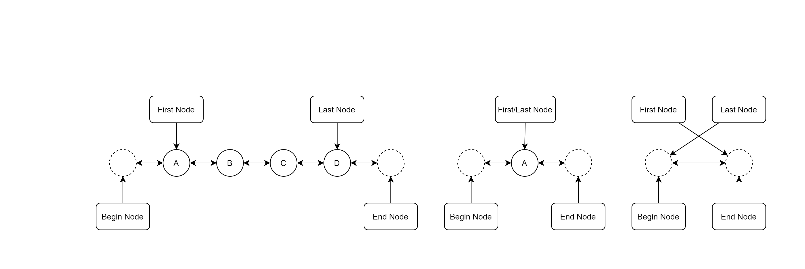

# Double Linked List
A library presenting a generic double linked list.

Double linked list structure implemented:



## Usage

Create a new empty list, from iterables or from another list

```dart
import 'package:double_linked_list/double_linked_list.dart';

main() {
  final emptyList = DoubleLinkedList<int>.empty();
  
  final fromList = DoubleLinkedList<int>.fromIterable([1, 2, 3]);
  final fromListExtension = [1, 2, 3].toDoubleLinkedList();
  
  final fromSet = DoubleLinkedList<int>.fromIterable({1, 2, 3});
  final fromSetExtension = {1, 2, 3}.toDoubleLinkedList();
  
  final copyList = DoubleLinkedList<int>.from(fromList);
  final copyListMethod = copyList.copy();
}
```

Iterate over a list in normal or reverse order

```dart
import 'package:double_linked_list/double_linked_list.dart';

main() {
  final list = [1, 3, 5].toDoubleLinkedList();
  for (var node = list.first; !node.isEnd; node = node.next) {
    node = node.insertAfter(node.content + 1);
  }
  print(list); // [1, 2, 3, 4, 5, 6]
  
  for (var node = list.last; !node.isBegin; node = node.previous) {
    print(node.content);
  }
  // 6 5 4 3 2 1
}
```

Be careful when iterating and inserting elements:

```dart
import 'package:double_linked_list/double_linked_list.dart';

main() {
  final list = [1, 3, 5].toDoubleLinkedList();
  for (var node = list.first; !node.isEnd; node = node.next) {
    node.insertAfter(node.content + 1);
  }
}
```
:warning:Program stuck at an endless loop.

To avoid this, move to the inserted node:

```dart
import 'package:double_linked_list/double_linked_list.dart';

main() {
  final list = [1, 3, 5].toDoubleLinkedList();
  for (var node = list.first; !node.isEnd; node = node.next) {
    node = node.insertAfter(node.content + 1);
  }
}
```

You can also use most of the functions available for Iterables, and some others:

```dart
import 'package:double_linked_list/double_linked_list.dart';

main() {
  final list = [1, 2, 3].toDoubleLinkedList();

  list.forEach(print);

  list.apply((e) => e * e);
  print(list); // [1 | 4 | 9]
    
  print(list.where((e) => e.isOdd)); // [1 | 9]
    
  print(list.reduce((value, element) => value + element)); // 14
  print(list.fold<int>(-14, (value, element) => value + element)); // 0
    
  print(list.any((e) => e > 2)); // true
  print(list.every((e) => e > 2)); // false
    
  print(list.firstWhere((e) => e > 2)); // (4)
  print(list.lastWhere((e) => e > 2)); // (9)
  
}
```

Complete example at [example](example/double_linked_list_example.dart).

## Features and bugs

Please file feature requests and bugs at the [issue tracker][tracker].

[tracker]: http://example.com/issues/replaceme
